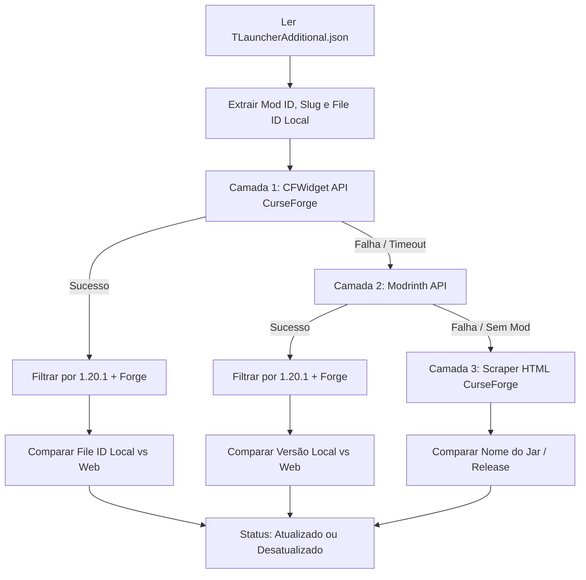

# Especificação Técnica: API & Scraper para Atualização de Mods (TLauncher / CurseForge)

Este documento descreve a arquitetura para identificação dos mods instalados localmente a partir dos arquivos do Minecraft/TLauncher e o método para consultar e comparar versões com os repositórios oficiais na web (**CurseForge** e **Modrinth**).

---

## 1. Identificação do Arquivo JSON Local

Após inspecionar o diretório `D:\Games\.minecraft\versions\UltimateMinePack`, identificamos o arquivo oficial de metadados gerenciado pelo TLauncher:

* **Arquivo Correto:** `D:\Games\.minecraft\versions\UltimateMinePack\TLauncherAdditional.json`
* **Tamanho:** ~740 KB
* **Localização dos Mods:** `modpack.version.mods` (array com 239 elementos)

### 1.1 Metadados Globais do Modpack
```json
{
  "modpack": {
    "name": "HorrorHardcoreZoio 2",
    "version": {
      "gameVersionDTO": {
        "id": 46,
        "name": "1.20.1"
      },
      "minecraftVersionName": {
        "id": 4372,
        "name": "47.4.23"
      },
      "minecraftVersionTypes": [
        {
          "id": 1,
          "name": "forge"
        }
      ]
    }
  }
}
```

### 1.2 Estrutura do Objeto de Cada Mod
Cada mod instalado contém o mapeamento direto com o catálogo do CurseForge:
```json
{
  "id": 60028,
  "name": "Aquaculture 2",
  "lanName": "aquaculture",
  "linkProject": "https://www.curseforge.com/minecraft/mc-mods/aquaculture",
  "version": {
    "id": 6296111,
    "name": "Aquaculture-1.20.1-2.5.5",
    "metadata": {
      "path": "mods/Aquaculture-1.20.1-2.5.5.jar",
      "sha1": "0b1fa66f4ceb5dcf6659fbb117dcf85b2cfc1b82",
      "size": 1391583
    }
  }
}
```

* **`id`**: CurseForge Project ID oficial (ex: `60028`).
* **`version.id`**: CurseForge File ID oficial da versão instalada (ex: `6296111`).
* **`version.name`**: Identificador da versão instalada.
* **`version.metadata.path`**: Nome do arquivo `.jar` na pasta `mods/`.

---

## 2. Arquitetura da Solução Web (API / Scraper)

Para consultar a versão mais recente na web sem exigir que o usuário crie chaves de API pagas ou proprietárias do Overwolf, foi desenhada uma estratégia híbrida em camadas:



### 2.1 Camada 1: CFWidget API (CurseForge Indexer) - Principal
* **Endpoint:** `GET https://api.cfwidget.com/{project_id}`
* **Autenticação:** Nenhuma (Livre / Open Source).
* **Parâmetros:**
  * `{project_id}`: ID numérico do mod (ex: `60028` para Aquaculture 2).
* **Resposta JSON:**
  ```json
  {
    "id": 60028,
    "title": "Aquaculture 2",
    "files": [
      {
        "id": 7331172,
        "name": "Aquaculture-1.20.1-2.5.7.jar",
        "versions": ["1.20.1", "Forge", "NeoForge"],
        "uploaded_at": "2025-12-14T05:36:23.493Z"
      }
    ]
  }
  ```
* **Lógica de Filtragem:**
  1. Filtra os itens de `files` onde `versions` contenha `1.20.1` e (`Forge` ou `NeoForge`).
  2. O primeiro item resultante é a versão estável mais recente.
  3. Compara o `latest_file_id` com o `installed_file_id` do JSON local.

### 2.2 Camada 2: Modrinth API - Secundária / Fallback
* **Endpoint:** `GET https://api.modrinth.com/v2/project/{slug}/version`
* **Query Params:**
  * `game_versions=["1.20.1"]`
  * `loaders=["forge"]`
* **Exemplo de URL:**
  `https://api.modrinth.com/v2/project/aquaculture/version?game_versions=%5B%221.20.1%22%5D&loaders=%5B%22forge%22%5D`
* **Vantagens:** API REST nativa, extremamente rápida e suporta a maioria dos mods modernos.

### 2.3 Camada 3: Web Scraper (CurseForge Fallback)
* **URL:** `https://www.curseforge.com/minecraft/mc-mods/{lanName}/files?page=1&pageSize=20&gameVersion=1.20.1`
* **Método:** Requisição HTTP com header `User-Agent` simulando browser e parser HTML.
* **Uso:** Utilizado apenas caso o mod não seja indexado pelas duas APIs anteriores.

---

## 3. Algoritmo de Comparação de Versões

A comparação ocorre por três critérios ordenados por precisão:

1. **Comparação por File ID (CurseForge):**
   * Como o CurseForge incrementa o ID de arquivo a cada novo upload:
     * Se `latest_file_id == installed_file_id`: **`UP_TO_DATE`** (Atualizado).
     * Se `latest_file_id > installed_file_id`: **`UPDATE_AVAILABLE`** (Atualização disponível).
2. **Comparação por Nome / SemVer:**
   * Se o File ID não for compatível entre provedores, o sistema analisa a numeração de versão (ex: `2.5.5` vs `2.5.7`).
3. **Data de Publicação:**
   * Caso a data de upload na web seja posterior ao timestamp de atualização registrado no arquivo local.

---

## 4. Script de Teste

O script de teste foi implementado em Python em:
* Arquivo: `test_update_checker.py`
* Execução:
  ```powershell
  python test_update_checker.py 5
  ```
  *(Substitua `5` pelo número de mods desejado para testar)*
