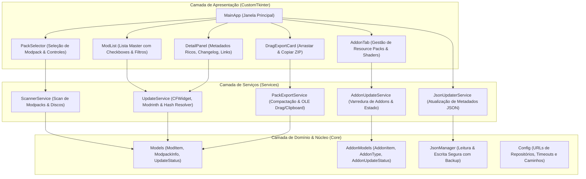

<div align="center">

  

  # TLauncher Mod Update Checker

  <p align="center">
    <strong>Gerenciador moderno de atualizações e sincronização de modpacks para TLauncher / Minecraft.</strong><br />
    Desenvolvido em <strong>Python 3.13</strong>, <strong>CustomTkinter</strong>, arquitetura limpa e integração nativa com o ecossistema CurseForge, Modrinth e TLauncher CDN.
  </p>

  <p align="center">
    <a href="https://www.python.org/" target="_blank">
      
    </a>
    <a href="https://customtkinter.tomschimansky.com/" target="_blank">
      
    </a>
    
    
    
    <a href="LICENSE">
      
    </a>
  </p>

  <p align="center">
    <a href="#-visão-geral">Visão Geral</a> •
    <a href="#-diferenciais--inovações">Diferenciais</a> •
    <a href="#-funcionalidades">Funcionalidades</a> •
    <a href="#-arquitetura-e-design">Arquitetura</a> •
    <a href="#-tecnologias">Tecnologias</a> •
    <a href="#-instalação-e-execução">Instalação</a> •
    <a href="#-roadmap">Roadmap</a> •
    <a href="#-autor">Autor</a>
  </p>

</div>

---

## 🌿 Visão Geral

**TLauncher Mod Update Checker** é uma aplicação desktop de alta performance criada para inspecionar, comparar, atualizar e sincronizar modpacks locais do Minecraft gerenciados pelo TLauncher sem corromper arquivos ou depender de downloads externos manuais.

Operando de forma cirúrgica sobre o arquivo oficial `TLauncherAdditional.json`, a ferramenta identifica todos os Mods, Resource Packs e Shaders instalados, consulta as versões mais recentes nos repositórios oficiais (**CurseForge** e **Modrinth**) e atualiza os metadados diretamente no JSON — permitindo que o próprio TLauncher efetue os downloads oficiais com integridade de hash garantida.

### O Problema que Resolve
* **Corrupção de Modpacks:** Modpacks do TLauncher utilizam um formato proprietário em `TLauncherAdditional.json`. Atualizar arquivos `.jar` manualmente quebra a sincronização do lançador, gerando erros como `illegal hash` ou falhas de inicialização.
* **Erros 404 no Repositório do TLauncher:** Mods atualizados na CurseForge frequentemente demoram para ser espelhados nos servidores do TLauncher (`rescl.tlauncher.org`). Nosso checker verifica a disponibilidade prévia no CDN oficial antes de permitir a aplicação da atualização.
* **Sobrescrita Indesejada de Resource Packs:** Atualizações convencionais redefinem o estado de pacotes de textura ativos. Nossa solução preserva estritamente `stateGameElement` ("active" / "no_active").
* **Dificuldade de Compartilhamento:** Enviar modpacks completos com gigabytes de `.jar` é lento e inviável. Nosso sistema gera um **Sync ZIP em milissegundos** (~1,2 MB) com suporte a **Drag-and-Drop nativo** para Discord, WhatsApp e pastas do sistema.

---

## ✨ Diferenciais & Inovações

| Inovação | Descrição Técnica |
| :--- | :--- |
| **Validação Prévia de CDN (Anti-404)** | Checagem de disponibilidade em tempo real via requisições `HEAD`/`Range` no repositório oficial do TLauncher (`rescl.tlauncher.org`). Um mod ou addon só é marcado como pronto se já existir no espelho oficial. |
| **Resolução Precisa de Hashes SHA-1** | Consulta automática da API de arquivos da CurseForge (`api.curse.tools`), garantindo que o novo SHA-1 e o tamanho do arquivo correspondam exatamente ao esperado pelo lançador, eliminando qualquer erro de `illegal hash`. |
| **Zero Download de JARs** | A aplicação **nunca baixa arquivos `.jar` diretamente**. Ela atua exclusivamente como orquestradora de metadados no `TLauncherAdditional.json`, mantendo a integridade total do motor nativo do TLauncher. |
| **Preservação Estrita de Estado (`stateGameElement`)** | Ao atualizar Resource Packs e Shaders, o estado de ativação (`active` vs `no_active`) é preservado integralmente, impedindo desconfigurações nas escolhas visuais do jogador. |
| **Exportação Instantânea com OLE Drag & Drop** | Componente visual interativo que compacta `TLauncherAdditional.json`, `config/`, `options.txt` e pastas essenciais em um `.zip` ultraleve em ~300ms, permitindo arrastar o arquivo diretamente para o Discord ou colar com `Ctrl+V` (`CF_HDROP`). |
| **Diagnóstico de Performance e Conflitos** | Análise e correção automática de gargalos críticos de carregamento (como indexação síncrona do JEI, mixins de busca do ModernFix e ordenação correta das camadas de Resource Packs). |

---

## 🎮 Funcionalidades

### 🧩 Gerenciamento Completo de Mods
- **Scaneamento Automático:** Detecção automática de modpacks na pasta do Minecraft (`%APPDATA%\.minecraft` e discos adicionais como `D:\Games\.minecraft`).
- **Verificação Multithread Assíncrona:** Consulta rápida em lote utilizando `ThreadPoolExecutor` com retorno em tempo real de progresso e estatísticas.
- **Painel Master-Detail Rico:** Visualização de changelogs, categorias, autores, downloads totais/mensais, links de código-fonte e licenças.
- **Filtros Inteligentes:** Filtragem por *Todos*, *Com Atualização*, *Confirmados TLauncher* e *Já Atualizados*.
- **Limpeza Automática de `.jar` Antigos:** Remoção opcional e segura da versão antiga ao atualizar para evitar duplicatas na pasta `mods/`.

### 🎨 Aba Dedicada para Addons (Resource Packs & Shaders)
- **Visualização Dedicada:** Gestão separada de pacotes de textura (`resourcepacks/`) e shaders (`shaderpacks/`).
- **Badges de Estado Visual:** Identificação clara se o pacote está atualmente ativo ou inativo no jogo.
- **Atualização Segura de Versão:** Atualização dos links e caminhos sem tocar no estado de carregamento do Minecraft.

### 📤 Arrastar para Enviar (Sync Pack ZIP)
- **Geração em Milissegundos:** Criação automática de pacotes de sincronização leves (~1 MB) contendo JSONs de metadados, pastas `config/`, `defaultconfigs/` e `options.txt`.
- **Drag-and-Drop Nativo do Windows:** Arraste o card diretamente para fora da janela (para o Discord, Telegram, WhatsApp ou Área de Trabalho).
- **Cópia para Clipboard:** Coloque o arquivo `.zip` na Área de Transferência como objeto de arquivo do Windows (`CF_HDROP`) com apenas um clique para colar em qualquer aplicativo via `Ctrl + V`.

---

## 🏗️ Arquitetura e Design

O projeto adota princípios de **Clean Architecture** e **SOLID**, desacoplando a interface visual das regras de negócio e serviços de rede:



### Estrutura de Diretórios

```plaintext
TLauncherModUpdateChecker/
├── src/
│   ├── core/                      # Modelos de domínio, entidades e constantes
│   │   ├── addon_models.py        # Modelos de Resource Packs e Shader Packs
│   │   ├── config.py              # URLs, endpoints de APIs e caminhos padrão
│   │   ├── json_manager.py        # Serialização e manipulação do TLauncherAdditional.json
│   │   └── models.py              # Modelos de ModItem, ModpackInfo e status
│   ├── services/                  # Regras de negócio e comunicação com repositórios
│   │   ├── addon_service.py       # Consulta de atualizações para addons
│   │   ├── addon_updater_service.py # Atualizador do JSON para resource packs/shaders
│   │   ├── image_service.py       # Carregamento e cache assíncrono de miniaturas
│   │   ├── json_updater_service.py  # Atualizador seguro de mods no JSON
│   │   ├── pack_export_service.py # Empacotamento em milissegundos e OLE Drag/Drop
│   │   ├── scanner_service.py     # Localização de pastas de versões do Minecraft
│   │   └── update_service.py      # Verificação de versões (CFWidget, Modrinth e Hashes)
│   └── ui/                        # Componentes gráficos CustomTkinter
│       ├── components/            # Widgets reutilizáveis (lista, detalhe, drag card)
│       │   ├── addon_card.py
│       │   ├── addon_detail_panel.py
│       │   ├── addon_list.py
│       │   ├── detail_panel.py
│       │   ├── drag_export_card.py # Card interativo com Drag-and-Drop
│       │   ├── mod_card.py
│       │   ├── mod_list.py
│       │   ├── pack_selector.py
│       │   └── progress_panel.py
│       ├── tabs/                  # Abas principais da interface
│       │   └── addon_tab.py       # Aba de Resource Packs e Shaders
│       └── app.py                 # Janela principal e controle de fluxo
├── tests/                         # Suíte de testes unitários e de integração
│   ├── test_integration.py
│   ├── test_json_updater.py
│   ├── test_pack_export.py
│   └── test_scanner.py
├── main.py                        # Ponto de entrada da aplicação
├── requirements.txt               # Dependências do projeto
└── PERFORMANCE_AND_MULTIPLAYER_GUIDE.md # Guia técnico analítico de otimizações
```

---

## 🛠️ Tecnologias e Bibliotecas

<div align="center">
  
</div>

<br />

| Componente | Tecnologia | Finalidade |
| :--- | :--- | :--- |
| **Linguagem Principal** | Python 3.10+ (Testado em 3.13) | Execução veloz, concorrência com threads e manipulação de arquivos |
| **Interface Gráfica (GUI)** | CustomTkinter (v5.2.2) | Interface moderna com suporte nativo a modo escuro e widgets polidos |
| **Processamento de Imagens** | Pillow (PIL) | Decodificação e redimensionamento de thumbnails e ícones de mods |
| **Integração com Windows** | pywin32 + pythonnet | Suporte nativo a Drag & Drop OLE (`System.Windows.Forms`) e Clipboard (`CF_HDROP`) |
| **APIs de Consulta** | CFWidget API + Modrinth API v2 | Consulta livre de metadados sem necessidade de chaves de API pagas |
| **API de Hashes Oficiais** | CurseForge API Proxy (`api.curse.tools`) | Obtenção de hashes SHA-1 oficiais (`algo 1`) e tamanhos de arquivos exatos |
| **Validação de Repositório** | TLauncher CDN (`rescl.tlauncher.org`) | Verificação prévia de disponibilidade dos arquivos antes da atualização |
| **Testes Automatizados** | unittest (Python Standard Library) | Suíte automatizada de testes para scanners, serialização e exportação |

---

## 🚀 Instalação e Execução

### Pré-requisitos
* **Python 3.10 ou superior** instalado ([Download oficial](https://www.python.org/downloads/)).
* Sistema operacional **Windows 10 ou 11**.

### Clonando o Repositório
```bash
git clone https://github.com/ChickChuck2/TLauncherModUpdateChecker.git
cd TLauncherModUpdateChecker
```

### Criando e Ativando o Ambiente Virtual (Opcional, mas Recomendado)
```powershell
python -m venv venv
.\venv\Scripts\activate
```

### Instalando as Dependências
```bash
pip install -r requirements.txt
```

### Executando a Aplicação
```bash
python main.py
```

### Executando os Testes Automatizados
```bash
python -m unittest discover tests
```

---

## 🎯 Status do Projeto & Roadmap

### ✅ Implementado
- [x] Leitura e escrita bidirecional em `TLauncherAdditional.json` com backup automático (`.bak`).
- [x] Verificação multithread de versões na CurseForge via CFWidget e Modrinth com cache inteligente.
- [x] Consulta de SHA-1 e tamanho direto na CurseForge para eliminar o erro `illegal hash`.
- [x] Validação prévia de disponibilidade no repositório oficial do TLauncher (Anti-404).
- [x] Interface moderna escura em CustomTkinter com layout Master-Detail.
- [x] Aba dedicada para Resource Packs e Shaders preservando `stateGameElement`.
- [x] Card interativo **Arrastar para Enviar** com suporte nativo a OLE Drag-and-Drop e `Ctrl+V`.
- [x] Guia analítico de performance para carregamento de inventário, chunks e multijogador.

### 🧭 Próximos Passos (Roadmap)
- [ ] Exportação com upload direto em um clique para serviços temporários (GoFile / Catbox) com link encurtado.
- [ ] Detecção e aviso de dependências ausentes de mods recém-atualizados.
- [ ] Suporte a perfis de múltiplos lançadores (Prism Launcher / Modrinth App).

---

## 🤝 Contribuição

Contribuições são muito bem-vindas! Se você deseja colaborar:

1. Faça um **Fork** do projeto.
2. Crie uma branch para a sua funcionalidade:
   ```bash
   git checkout -b feature/minha-nova-funcionalidade
   ```
3. Realize seus commits seguindo mensagens semânticas:
   ```bash
   git commit -m "feat: adiciona suporte a exportacao de logs simplificados"
   ```
4. Envie as alterações para o seu fork:
   ```bash
   git push origin feature/minha-nova-funcionalidade
   ```
5. Abra um **Pull Request** detalhado explicando as alterações realizadas.

---

## 📄 Licença

Este projeto está licenciado sob a licença **MIT**. Consulte o arquivo [LICENSE](LICENSE) para mais detalhes.

---

<div align="center">
  <sub>Criado com dedicação e paixão por arquitetura limpa por <a href="https://github.com/ChickChuck2">ChickChuck2</a>.</sub>
</div>
